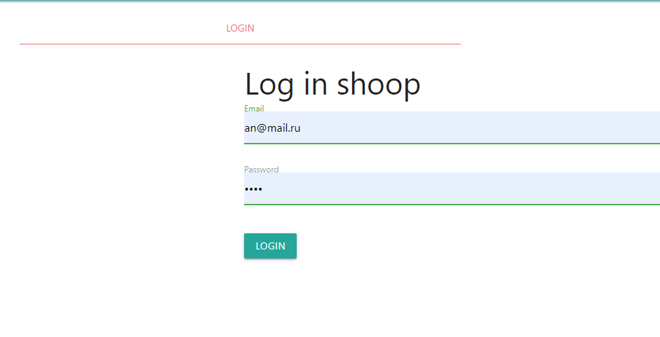
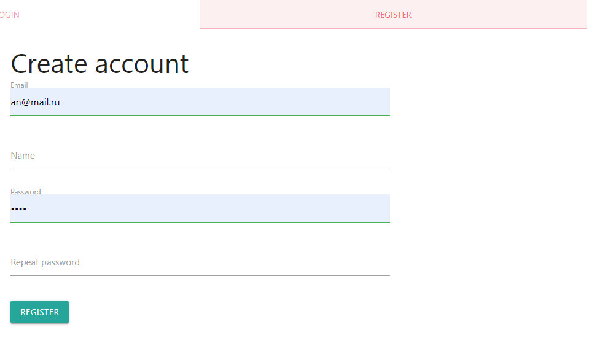
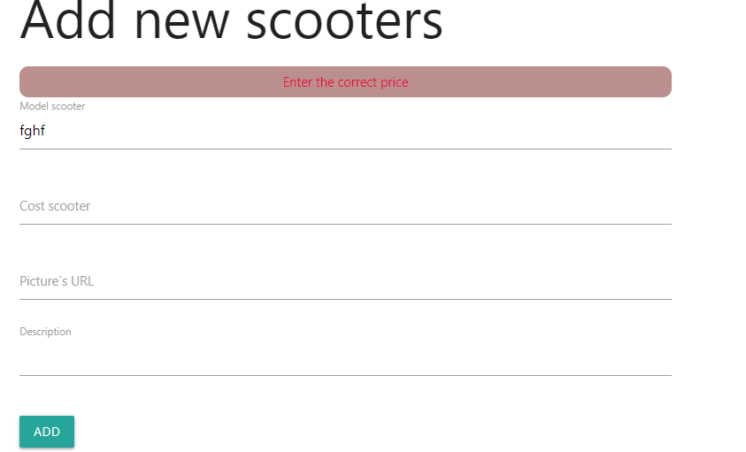
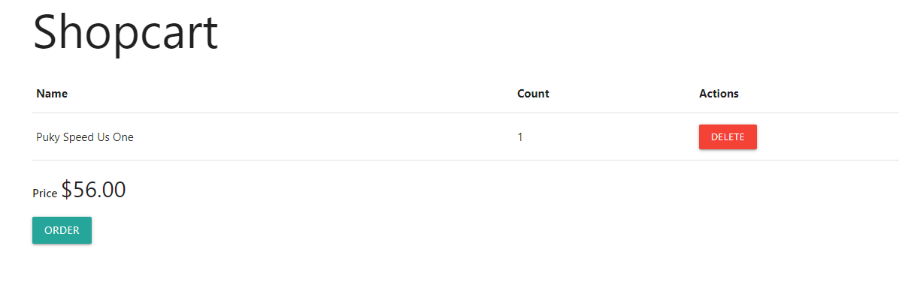
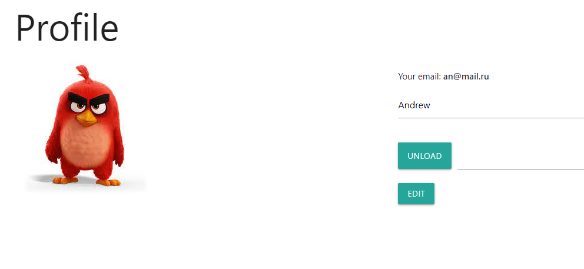
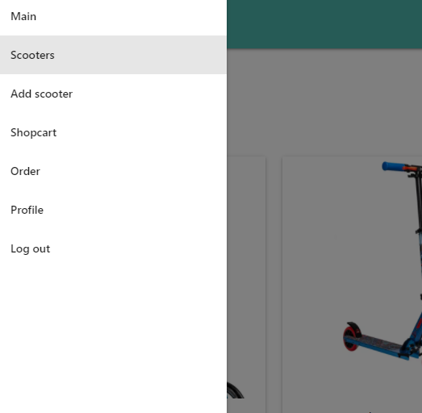

# Node.js. Scooter.by

###### deployment: https://scooter-shop.herokuapp.com

## Description
This is a scooter store that has all the necessary functions for logging in, registering, users, shopping cart, orders, functions created and edit scooter cards, save photo for profile and ect.

## Use tools
Handlebars, express,  mongoose, express-handlebars,multer, csurf, bcryptjs and ect.
MongoDB Atlas was used as the database.
## Login and Sign up
You can use this email (am@mai.ru, 1234) or sign up by yourself.

## Add new scooters
You can add new scooters, but you should pay attention validation of fields

## Add new scooters
As well You can add scooters in the shop cart and delete them

## Add new scooters
There is possible add photo for your profile

## Add new scooters
Adaptive navigation bar that hides for small screens

